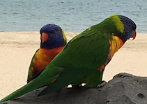

```{r echo=FALSE}
knitr::opts_chunk$set(
  message = FALSE,
  warning = FALSE,
  error = FALSE, 
  collapse = TRUE,
  comment = "#>",
  fig.height = 4,
  fig.width = 8,
  fig.align = "center",
  cache = TRUE
)
```

```{r echo=FALSE}
library(tidyverse)
library(ggmap)
library(HLMdiag)
library(RColorBrewer)
library(gridExtra)
library(dichromat)
library(xkcd)
```


class: inverse middle 
# Your turn



- What is a (data) plot?
- What are the three most important data plots?


---
class: inverse middle 
# Your turn

How would you describe this plot?

```{r echo=FALSE}
olive <- read_csv("../data/olive.csv")
ggplot(olive, aes(x = oleic, y = linoleic, colour = factor(region))) +
  geom_point() +
  theme(aspect.ratio = 1)
```

---
class: inverse middle 
# Your turn

What about this one?

```{r echo=FALSE}
ggplot(olive, aes(x = factor(area), y = eicosenoic)) +
  geom_boxplot() +
  xlab("Area")
```

---
# Using the package ggplot2

Elements of a plot

- data
- aesthetics: mapping of variables to graphical elements
- geom: type of plot structure to use
- transformations: log scale, ...

Additional components 

- layers: multiple geoms, multiple data sets, annotation
- facets: show subsets in different plots
- themes: modifying style

---
# Why use a grammar of graphics?

<br>
<br>
<font face="DidyBold" size=6>
Variable in the data is directly mapped to an element in the plot </font>

---
# Data - Olive

```{r}
glimpse(olive)
```

---
# Plotting points

```{r}
ggplot(olive, aes(x = oleic, y = linoleic, colour = factor(region))) +
  geom_point() +
  theme(aspect.ratio = 1)
```

---
class: inverse middle 
# Your turn


How is the data mapped to graphical elements?

- data: _______
- aesthetics: _________
- geom: ________
- transformations: _________

```{r echo=FALSE, eval=FALSE}
autism, x and y position along a line, point, none
```

---
# Adding density layer

```{r}
ggplot(olive, aes(x = oleic, y = linoleic, colour = factor(region))) +
  geom_point() +
  geom_density2d() +
  theme(aspect.ratio = 1)
```

---
class: inverse middle 
# Your turn


How is the data mapped to graphical elements?

- data: _______
- aesthetics: _________
- geom: ________
- transformations: _________

---
# Too much ink

```{r}
ggplot(olive, aes(x = oleic, y = linoleic, colour = factor(region))) +
  geom_point(alpha = 0.6) +
  geom_density2d(alpha = 0.6) +
  theme(aspect.ratio = 1)
```

---
class: inverse middle 
# Your turn


What do we learn about the composition of fatty acids found in the lipid fraction of Italian olive oils?

```{r echo=FALSE, eval=FALSE}
In terms of categorisation into either pdd or autism the vsae score is not distinct, but on average the autism diagnosis 2 year olds have lower scores. There a lot of overlap between ths group.
```

---

# More example -- Soil composition data and corn yield

```{r}
baker <- read_csv("../data/baker.csv")
baker
```

---

# Plotting tiles: corn yield in the field 

```{r}
ggplot(baker, aes(x = X, y = Y, fill = Corn97BU)) +
  geom_tile() +
  theme_bw() +
  theme(aspect.ratio = 1)
```

---

## Plotting points between B and Corn Yield

```{r}
ggplot(baker, aes(x = B, y = Corn97BU)) +
  geom_point() +
  theme(aspect.ratio = 1)
```

---

## Plotting points between Fe and Corn Yield by Cu

```{r}
ggplot(baker, aes(x = Fe, y = Corn97BU, colour = Cu)) +
  geom_point() +
  theme(aspect.ratio = 1)
```

---

# Split Cu by high and low

```{r}
baker_cat <- baker %>% 
  mutate(Cu_cat = ifelse(Cu > 2.5, "High", "Low"))
ggplot(baker_cat, aes(x = Fe, y = Corn97BU, colour = Cu_cat)) +
  geom_point() +
  theme(aspect.ratio = 1)
```

---

# Adding regression line

```{r}
ggplot(baker_cat, aes(x = Fe, y = Corn97BU, colour = Cu_cat)) +
  geom_point(alpha = 0.6) +
  geom_smooth(method = "lm") +
  theme(aspect.ratio = 1)
```


---
# New example - Flying etiquette

[41% Of Fliers Think You’re Rude If You Recline Your Seat](http://fivethirtyeight.com/datalab/airplane-etiquette-recline-seat/)

```{r}
fly <- read_csv("../data/flying-etiquette.csv")
glimpse(fly)
```

---
# Variables

- Mix of categorical and quantiative variables. 
- What mappings are appropriate? 
- Area for counts of categories.
- side-by-side boxplots for mixed pair. 

---
# Support

```{r}
ggplot(fly, aes(x=`How often do you travel by plane?`)) + 
  geom_bar() + coord_flip()
```

**Any room in improving the plot?**

--

Categories are not sorted.

---
# Sorted categories

```{r}
fly <- fly %>% 
  mutate(`How often do you travel by plane?` = 
    fct_relevel(`How often do you travel by plane?`,
      "Never","Once a year or less","Once a month or less",
      "A few times per month","A few times per week","Every day"
    )
  )
ggplot(fly, aes(x=`How often do you travel by plane?`)) + 
  geom_bar() + 
  coord_flip()
```

---
# Sorted categories

```{r}
ggplot(fly, 
  aes(x=`How often do you travel by plane?`, 
    fill=`How often do you travel by plane?`)
  ) + 
  geom_bar() + 
  coord_flip() +
  scale_fill_brewer(palette="Dark2")
```

---
# Filter data

```{r}
fly_sub <- fly %>% 
  filter(
    `How often do you travel by plane?` %in% 
    c("Once a year or less","Once a month or less")
  ) %>%
  drop_na(`Do you ever recline your seat when you fly?`, Age, Gender)
```

---
# Recline by height

```{r}
fly_sub <- fly_sub %>% 
  mutate(`Do you ever recline your seat when you fly?` = 
    fct_relevel(`Do you ever recline your seat when you fly?`,
      "Never","Once in a while","About half the time","Usually","Always"
    )
  )
ggplot(fly_sub, aes(
    x=`Do you ever recline your seat when you fly?`, 
    y=`How tall are you?`
  )) + geom_boxplot() + coord_flip()
```


---
class: inverse middle 
# Your turn


- Take a look at the ggplot2 [Cheat sheet](https://www.rstudio.com/wp-content/uploads/2016/11/ggplot2-cheatsheet-2.1.pdf)
- How many geoms are available in ggplot2? What is `geom_rug`?

```{r echo=FALSE, eval=FALSE}
A lot of geoms!
  
geom_rug adds tick marks to the axis, particularly for a scatterplot, or density, indicating values of data on that variable. 
```


---
class: inverse middle 
# Your turn


What is the difference between `colour` and `fill`?

```{r echo=FALSE, eval=FALSE}
# colour is for 0 or 1-dimensional elements, and fill is for area (2-d) geoms
```

---
class: inverse middle 
# Your turn


What does `coord_fixed()` do? What is the difference between this and using `theme(aspect.ratio=...)`?

```{r echo=FALSE, eval=FALSE}
coord_fixed operates on the raw data values, but theme(aspect_ratio=...) works on the plot dimensions
```

---
class: inverse middle 
# Your turn


What are scales? How many numeric transformation scales are there?

```{r echo=FALSE, eval=FALSE}
scales do the transformation between data values and graphical element value. most often it is applied to position along x, y which is common, to log or sqrt, .. there are 3 numeric transformations. 
```

---
class: inverse middle 
# Your turn


What are position adjustments? When would they be used?

```{r echo=FALSE, eval=FALSE}
positions shift the location some from original coordinates. most often used with bar charts to stack, or put side-by-side
```

---
class: inverse middle 
# Your turn 


Use your cheat sheet to work out how to make plot to explore the relationship between 

`Do you ever recline your seat when you fly?` and `Is it rude to recline your seat on a plane?`

```{r echo=FALSE, eval=FALSE}
ggplot(fly_sub, aes(x=`Do you ever recline your seat when you fly?`)) +
  geom_bar() + 
  facet_wrap(~`Is itrude to recline your seat on a plane?`, ncol=3) +
  coord_flip()
ggplot(fly_sub, aes(x=`Do you ever recline your seat when you fly?`,
    fill=`Is itrude to recline your seat on a plane?`)) +
  geom_bar(position="fill") +
  coord_flip()
```


---
# Facets

```{r}
ggplot(fly_sub, aes(x=`In general, is itrude to bring a baby on a plane?`)) + 
  geom_bar() + 
  coord_flip() + 
  facet_wrap(~Gender)
```

---
# Facets

```{r}
fly_sub <- fly_sub %>% 
  mutate(Age = factor(Age, levels=c("18-29","30-44","45-60","> 60")))
ggplot(fly_sub, aes(x=`In general, is itrude to bring a baby on a plane?`)) + 
  geom_bar() + 
  coord_flip() + 
  facet_grid(Age~Gender)
```

---

class: inverse middle 
# Your turn 


What's the difference between `facet_wrap()` and `facet_grid()`?

---

# Temporal example -- daily temperatures

```{r, echo = FALSE}
otway_weather <- read_csv("../data/weather_2016.csv")
otway_tidy <- otway_weather %>% 
  gather(DAY, VALUE, VALUE1:VALUE31) %>% 
  mutate(
    DAY = str_sub(DAY, start = 6),
    DATE = ymd(paste(YEAR, MONTH, DAY, sep = "-"))
  ) %>% 
  arrange(DATE) %>% 
  select(ID, DATE, ELEMENT, VALUE) %>% 
  filter(!(is.na(DATE))) %>% 
  mutate(
    VALUE = if_else(VALUE < -999, NA_integer_, VALUE),
    VALUE = VALUE / 10
  ) %>% 
  spread(ELEMENT, VALUE)
otway_temp <- otway_tidy %>% 
  mutate(
    MONTH = month(DATE, label = TRUE),
    DAY = mday(DATE)
  ) %>% 
  select(ID, DATE, TMAX, TMIN, MONTH, DAY)
otway_temp
```

---

# Time series plot

```{r}
ggplot(otway_temp, aes(x = DATE)) +
  geom_line(aes(y = TMAX), colour = "#1b9e77") +
  geom_line(aes(y = TMIN), colour = "#7570b3") +
  ylab("Daily maximum and minimum temperatures")
```

---

# Facetted by months

```{r, fig.height=5}
ggplot(otway_temp) +
  geom_rect(aes(xmin = DAY - 0.5, xmax = DAY + 0.5,  ymin = TMIN, ymax = TMAX),
    colour = "white", fill = "grey30") +
  facet_wrap(~ MONTH, ncol = 3) +
  xlab("Day") + ylab("Daily temperature")
```


---

# Map example -- whale sharks

The whale shark data was pulled from [https://www.whaleshark.org](https://www.whaleshark.org) 

```{r}
whalesharks <- read_csv("../data/whaleshark-encounters.csv")
library(lubridate) 
ningaloo <- whalesharks %>% 
  filter(grepl("Ningaloo", Locality)) %>% 
  mutate(date=ymd(paste(`Year Collected`, `Month Collected`, 
`Day Collected`, sep="-")))
ningaloo %>% select(date, `Marked Individual`, Longitude, Latitude)
```

---

# Track one individual

```{r}
library(ggmap) 
map <- get_map(location=c(lon=114.1, lat=-21.9), zoom=8) 
A524 <- ningaloo %>% 
  filter(`Marked Individual`=="A-524") 
ggmap(map) + 
  geom_point(data=A524, aes(x=Longitude, y=Latitude), colour="red") + 
  geom_line(data=A524, aes(x=Longitude, y=Latitude), colour="red") 
```

---

## Histogram: the distrubition of the number of sightings

```{r} 
ningaloo_nomiss <- ningaloo %>%
  drop_na(`Marked Individual`)
ningaloo_nomiss %>% 
  count(`Marked Individual`, sort=TRUE) %>% 
  ggplot(aes(x=n)) + 
  geom_histogram(binwidth=5)
```

```{r, echo = FALSE}
keep <- ningaloo_nomiss %>% 
count(`Marked Individual`, sort=TRUE) %>% 
filter(n>=40) 
ningaloo_freqwhales <- ningaloo %>% 
filter(`Marked Individual` %in% keep$`Marked Individual`) %>% 
arrange(date) 
``` 

---

# Facetted by different individuals

```{r}
ggmap(map) + 
  geom_point(data=ningaloo_freqwhales, 
    aes(x=Longitude, y=Latitude, colour=`Marked Individual`)) + 
  geom_line(data=ningaloo_freqwhales, aes(x=Longitude, y=Latitude, 
    colour=`Marked Individual`, group=`Marked Individual`)) + 
  facet_wrap(~`Marked Individual`, ncol=7) +
  theme(legend.position="None")
```

---

# Facetted by years collected

```{r}
ggmap(map) + 
  geom_point(data=ningaloo_freqwhales, aes(x=Longitude, y=Latitude, 
    colour=`Marked Individual`)) + 
  geom_line(data=ningaloo_freqwhales, aes(x=Longitude, y=Latitude, 
  colour=`Marked Individual`, group=`Marked Individual`)) + 
  facet_wrap(~`Year Collected`, ncol=6) +
  theme(legend.position="None")
```

---

# Facet by months collected

```{r}
ggmap(map) + 
  geom_point(data=ningaloo_freqwhales, aes(x=Longitude, y=Latitude, 
    colour=`Marked Individual`)) + 
  geom_line(data=ningaloo_freqwhales, aes(x=Longitude, y=Latitude, 
    colour=`Marked Individual`, group=`Marked Individual`)) + 
  facet_wrap(~`Month Collected`, ncol=4) +
  theme(legend.position="None") 
```


---

class: middle inverse center

# Graphical principles

---
# Color palettes - default

```{r}
p <- ggplot(fly_sub, aes(
  x=`In general, is itrude to bring a baby on a plane?`, fill=Gender
)) + 
  geom_bar(position="fill") + 
  coord_flip() + 
  facet_wrap(~Age, ncol=4)
p
```

What do we learn?

---
# Color palettes - brewer

```{r}
p + scale_fill_brewer(palette="Dark2") 
```

---
# Color blind-proofing

```{r fig.show='hide'}
library(scales)
library(dichromat)
clrs <- hue_pal()(3)
p + theme(legend.position = "none")
clrs <- dichromat(hue_pal()(3))
p + scale_fill_manual("", values=clrs) + theme(legend.position = "none")
```

---

```{r echo=FALSE, fig.width=4.5, fig.show='hold', fig.align='default'}
clrs <- hue_pal()(3)
p + theme(legend.position = "none")
clrs <- dichromat(hue_pal()(3))
p + scale_fill_manual("", values=clrs) + theme(legend.position = "none")
```

---
# Perceptual principles

- Hierarchy of mappings: (first) position along an axis - (last) color (Cleveland, 1984; Heer and Bostock, 2009)
- Pre-attentive: Some elements are noticed before you even realise it.
- Color: (pre-attentive) palettes - qualitative, sequential, diverging.
- Proximity: Place elements for primary comparison close together. 
- Change blindness: When focus is interrupted differences may not be noticed.

---
# Hierarchy of mappings

- 1.Position - common scale (BEST)
- 2.Position - nonaligned scale
- 3.Length, direction, angle
- 4.Area
- 5.Volume, curvature
- 6.Shading, color (WORST)

---
# Pre-attentive

Can you find the odd one out?

```{r echo=FALSE}
df <- data.frame(x=runif(100), y=runif(100), cl=sample(c(rep("A", 1), rep("B", 99))))
ggplot(data=df, aes(x, y, shape=cl)) + theme_bw() + 
  geom_point() +
  theme(legend.position="None", aspect.ratio=1)
```

---

Is it easier now?

```{r echo=FALSE}
ggplot(data=df, aes(x, y, colour=cl)) + 
  geom_point() +
  theme_bw() + 
  theme(legend.position="None", aspect.ratio=1)
```


---
# Color palettes

- Qualitative: categorical variables
- Sequential: low to high numeric values
- Diverging: negative to positive values

---

```{r, echo=FALSE, fig.height=7, fig.width=12}
library(RColorBrewer)
display.brewer.all()
```


---
# Proximity

```{r fig.show='hide'}
ggplot(fly_sub, aes(
  x=`In general, is itrude to bring a baby on a plane?`,fill=Gender
  )) + 
  geom_bar(position="fill") + 
  coord_flip() + 
  facet_wrap(~Age, ncol=5)
```

With this arrangement we can see proportion of gender within each rudeness category, and compare these across age groups.  How could we arrange this differently?

---


```{r echo=FALSE}
ggplot(fly_sub, aes(
  x=`In general, is itrude to bring a baby on a plane?`, fill=Gender
  )) + 
  geom_bar(position="fill") + 
  coord_flip() + 
  facet_wrap(~Age, ncol=5)
```


---
# Proximity

```{r fig.show='hide'}
ggplot(fly_sub, aes(
  x=Gender,fill=`In general, is itrude to bring a baby on a plane?`
  )) + 
  geom_bar(position="fill") + 
  coord_flip() + 
  facet_wrap(~Age, ncol=5) +
  theme(legend.position="bottom")
```

---

```{r echo=FALSE}
ggplot(fly_sub, aes(
  x=Gender,fill=`In general, is itrude to bring a baby on a plane?`
  )) + 
  geom_bar(position="fill") + 
  coord_flip() + 
  facet_wrap(~Age, ncol=5) + theme(legend.position="bottom")
```

What is different about the comparison now?

---
# Another arrangement

```{r fig.show='hide'}
ggplot(fly_sub, aes(
  x=Age, fill=`In general, is itrude to bring a baby on a plane?`)) + 
  geom_bar(position="fill") + 
  coord_flip() + 
  facet_wrap(~Gender, ncol=5) + 
  theme(legend.position="bottom")
```

---

```{r echo=FALSE}
ggplot(fly_sub, aes(x=Age,
                    fill=`In general, is itrude to bring a baby on a plane?`)) + 
  geom_bar(position="fill") + coord_flip() + facet_wrap(~Gender, ncol=5) + theme(legend.position="bottom")
```

---
# Themes

The `ggthemes` package has many different styles for the plots. Other packages such as `xkcd`, `skittles`, `wes anderson`, `beyonce`, ....

```{r fig.show='hide'}
library(xkcd)
ggplot(fly_sub, aes(
  x=Gender,fill=`In general, is itrude to bring a baby on a plane?`
  )) + 
  geom_bar(position="fill") + 
  coord_flip() + 
  facet_wrap(~Age, ncol=5) +
  theme_xkcd() + 
  theme(legend.position="bottom")
```

See the [vignette](https://cran.r-project.org/web/packages/xkcd/vignettes/xkcd-intro.pdf) for instructions on installing the xkcd font. 

---

```{r echo=FALSE}
library(xkcd)
ggplot(fly_sub, aes(x=Gender,
                    fill=`In general, is itrude to bring a baby on a plane?`)) + 
  geom_bar(position="fill") + coord_flip() + facet_wrap(~Age, ncol=5) +
  theme_xkcd() + theme(legend.position="bottom")
```

---
class: inverse middle 
# Your turn


Compile the rmarkdown document that you have put together thus far in the workshop!

---
# Resources

- ggplot2 [Cheat sheet](https://www.rstudio.com/wp-content/uploads/2016/11/ggplot2-cheatsheet-2.1.pdf)
- [ggplot2: Elegant Graphics for Data Analysis, Hadley Wickham](http://ggplot2.org/book/), [web site](http://ggplot2.org)
- [R Graphics Cookbook, Winston Chang](http://www.cookbook-r.com/Graphs/)
- [Naomi Robbins, Creating More Effective Graphs](http://www.nbr-graphs.com)
- [Antony Unwin, Graphical Data Analysis with R](https://www.crcpress.com/Graphical-Data-Analysis-with-R/Unwin/9781498715232)

---
# Share and share alike

This work is licensed under the Creative Commons Attribution-Noncommercial 3.0 United States License. To view a copy of this license, visit http://creativecommons.org/licenses/by-nc/3.0/us/ or send a letter to Creative Commons, 171 Second Street, Suite 300, San Francisco, California, 94105, USA.
